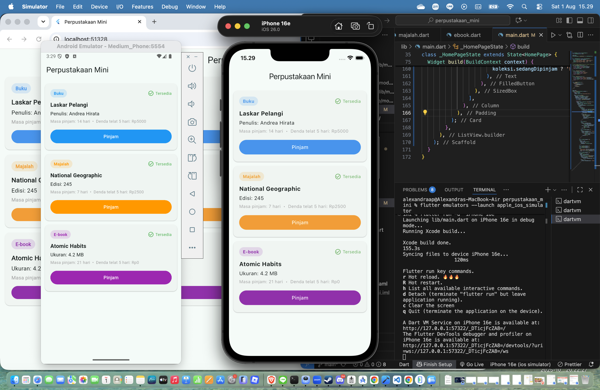
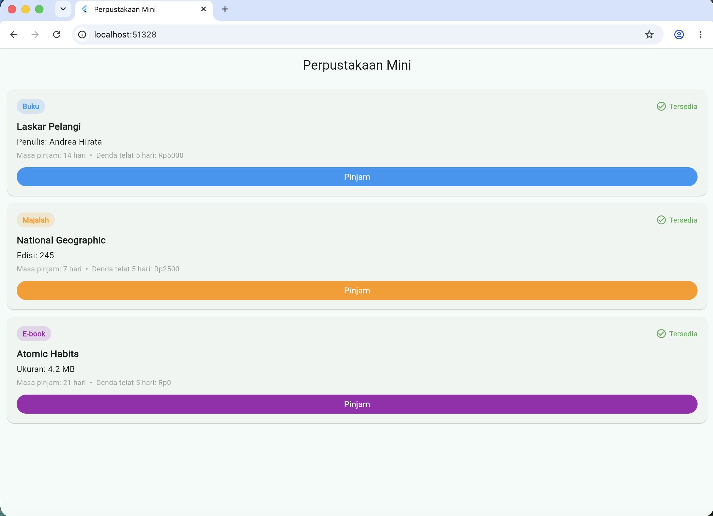
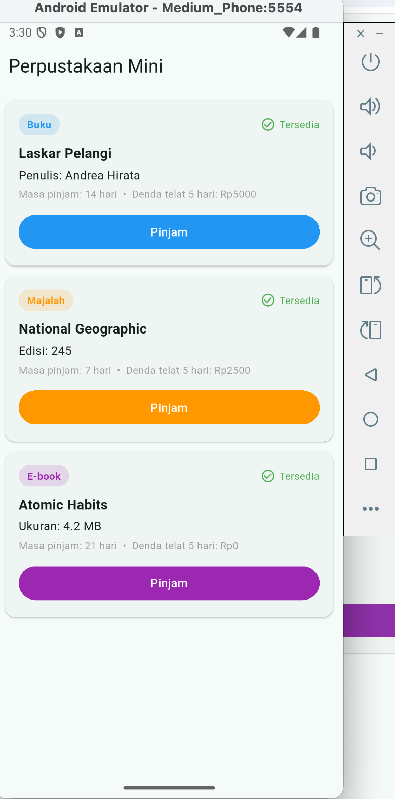
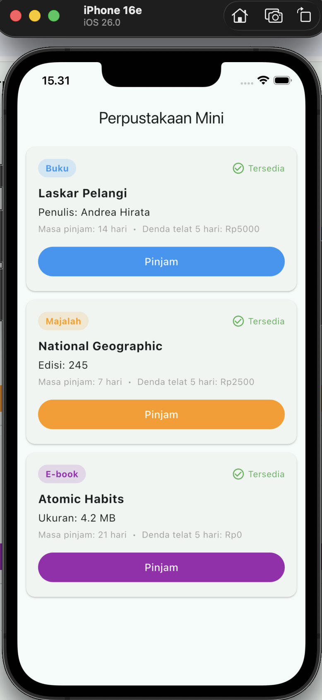

# Perpustakaan Mini - Tugas Bootcamp Flutter #2

## Identitas
- Nama: Alexandra Anindita Purnadi
- NIM: 2902632611

## Deskripsi Aplikasi
Perpustakaan Mini adalah aplikasi manajemen koleksi perpustakaan sederhana yang mencatat tiga jenis koleksi (Buku, Majalah, E-book), dengan fitur peminjaman, pengembalian, dan perhitungan denda otomatis sesuai aturan masing-masing jenis koleksi.

## Fitur Utama
- Melihat daftar koleksi (Buku, Majalah, E-book)
- Melihat detail tiap koleksi
- Meminjam koleksi
- Mengembalikan koleksi
- Menghitung denda keterlambatan secara otomatis

## Rancangan Database

### Tabel Koleksi (induk)
| Field | Tipe | Keterangan |
|---|---|---|
| id | String | ID unik koleksi |
| judul | String | Nama koleksi |
| sedangDipinjam | bool | Status peminjaman |
| tanggalPinjam | DateTime? | Tanggal koleksi dipinjam |

### Field tambahan per jenis koleksi
| Class | Field tambahan | Masa Pinjam | Denda/hari |
|---|---|---|---|
| Buku | penulis (String) | 14 hari | Rp1.000 |
| Majalah | edisi (int) | 7 hari | Rp500 |
| Ebook | ukuranFileMb (double) | 21 hari | Rp0 (tidak ada denda) |

## Penerapan Konsep OOP

### Abstraction
Class `Koleksi` dibuat sebagai `abstract class`, sehingga tidak bisa langsung diinstansiasi. Class ini hanya berfungsi sebagai cetakan untuk `Buku`, `Majalah`, dan `Ebook`.

### Inheritance
`Buku`, `Majalah`, dan `Ebook` masing-masing meng-extend `Koleksi`, sehingga otomatis mewarisi properti dan method umum seperti `pinjam()` dan `kembalikan()`.

### Polymorphism
Method `hitungDenda()` dan getter `masaPinjamHari` dideklarasikan di `Koleksi` tanpa implementasi, lalu di-override berbeda-beda di tiap class turunan. Saat dipanggil lewat satu `List<Koleksi>` yang sama, hasilnya berbeda tergantung jenis objeknya.

### Encapsulation
Properti seperti `_judul`, `_id`, dan `_sedangDipinjam` dibuat private, hanya bisa diakses lewat getter atau method resmi yang disediakan class `Koleksi`.

## Referensi UI
Desain mengacu pada pola umum aplikasi manajemen koleksi/perpustakaan: list berbasis card, badge warna untuk membedakan jenis koleksi, dan indikator status (tersedia/dipinjam) yang jelas secara visual.

## Screenshot Aplikasi

Aplikasi berhasil dijalankan dan diuji di tiga platform: Web, Android, dan iOS.

### Web (Chrome)

### Android (Emulator)

### iOS (Simulator)
